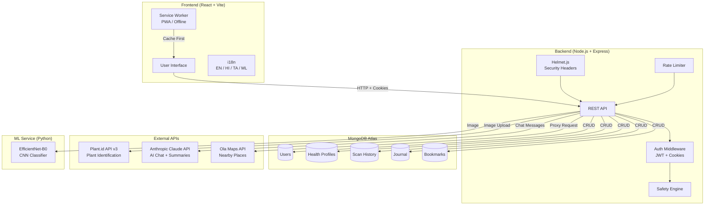
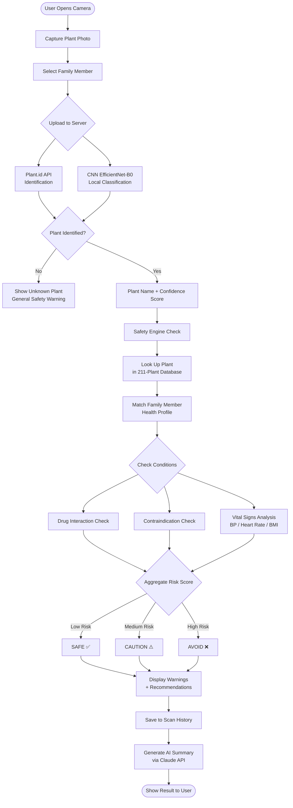
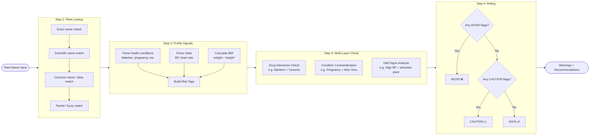
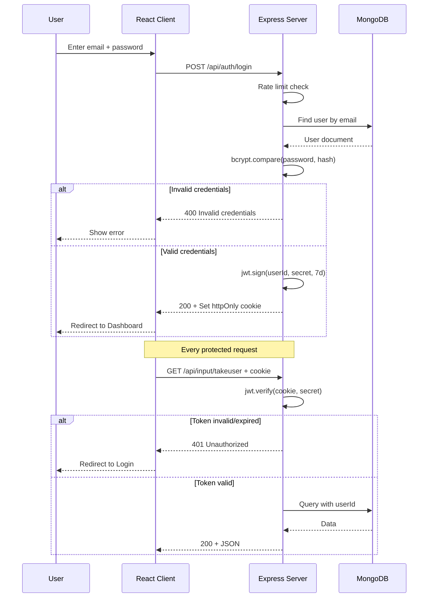
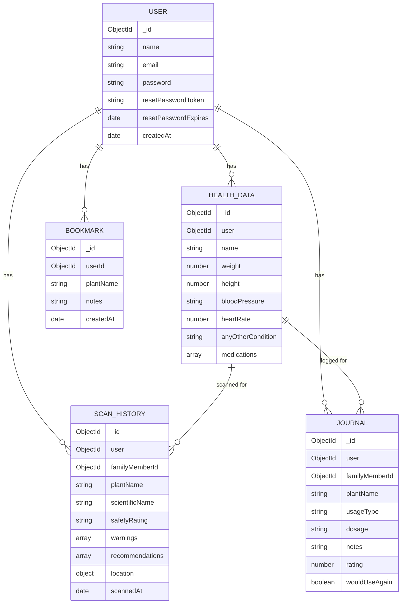

# Rooted — System Diagrams

---

## 1. System Architecture

```mermaid
graph TB
    subgraph Client["Frontend (React + Vite)"]
        UI[User Interface]
        SW[Service Worker\nPWA / Offline]
        i18n[i18n\nEN / HI / TA / ML]
    end

    subgraph Server["Backend (Node.js + Express)"]
        API[REST API]
        AUTH[Auth Middleware\nJWT + Cookies]
        SAFETY[Safety Engine]
        HELM[Helmet.js\nSecurity Headers]
        RATE[Rate Limiter]
    end

    subgraph Database["MongoDB Atlas"]
        USERS[(Users)]
        HEALTH[(Health Profiles)]
        SCANS[(Scan History)]
        JOURNAL[(Journal)]
        BOOKMARKS[(Bookmarks)]
    end

    subgraph ExternalAPIs["External APIs"]
        PLANTID[Plant.id API v3\nPlant Identification]
        CLAUDE[Anthropic Claude API\nAI Chat + Summaries]
        OLA[Ola Maps API\nNearby Places]
    end

    subgraph ML["ML Service (Python)"]
        CNN[EfficientNet-B0\nCNN Classifier]
    end

    UI -->|HTTP + Cookies| API
    SW -->|Cache First| UI
    API --> AUTH
    AUTH --> SAFETY
    API -->|CRUD| USERS
    API -->|CRUD| HEALTH
    API -->|CRUD| SCANS
    API -->|CRUD| JOURNAL
    API -->|CRUD| BOOKMARKS
    API -->|Image Upload| PLANTID
    API -->|Chat Messages| CLAUDE
    API -->|Proxy Request| OLA
    API -->|Image| CNN
    HELM --> API
    RATE --> API
```

---

## 2. Plant Scan Flowchart

```mermaid
flowchart TD
    A([User Opens Camera]) --> B[Capture Plant Photo]
    B --> C[Select Family Member]
    C --> D{Upload to Server}

    D --> E[Plant.id API\nIdentification]
    D --> F[CNN EfficientNet-B0\nLocal Classification]

    E --> G{Plant Identified?}
    F --> G

    G -->|No| H[Show Unknown Plant\nGeneral Safety Warning]
    G -->|Yes| I[Plant Name + Confidence Score]

    I --> J[Safety Engine Check]

    J --> K[Look Up Plant\nin 211-Plant Database]
    K --> L[Match Family Member\nHealth Profile]
    L --> M{Check Conditions}

    M --> N[Drug Interaction Check]
    M --> O[Contraindication Check]
    M --> P[Vital Signs Analysis\nBP / Heart Rate / BMI]

    N & O & P --> Q{Aggregate Risk Score}

    Q -->|Low Risk| R[SAFE ✅]
    Q -->|Medium Risk| S[CAUTION ⚠️]
    Q -->|High Risk| T[AVOID ❌]

    R & S & T --> U[Display Warnings\n+ Recommendations]
    U --> V[Save to Scan History]
    V --> W[Generate AI Summary\nvia Claude API]
    W --> X([Show Result to User])
```

---

## 3. Safety Engine Flow

```mermaid
flowchart LR
    A([Plant Name Input]) --> B

    subgraph B["Step 1: Plant Lookup"]
        B1[Exact name match]
        B2[Scientific name match]
        B3[Common name / alias match]
        B4[Partial / fuzzy match]
        B1 --> B2 --> B3 --> B4
    end

    B --> C

    subgraph C["Step 2: Profile Signals"]
        C1[Parse health conditions\ndiabetes, pregnancy, etc.]
        C2[Parse vitals\nBP, heart rate]
        C3[Calculate BMI\nweight ÷ height²]
        C1 & C2 & C3 --> C4[Build Risk Tags]
    end

    C --> D

    subgraph D["Step 3: Multi-Layer Check"]
        D1[Drug Interaction Check\ne.g. Warfarin + Turmeric]
        D2[Condition Contraindication\ne.g. Pregnancy + Aloe Vera]
        D3[Vital Signs Analysis\ne.g. High BP + stimulant plant]
    end

    D --> E

    subgraph E["Step 4: Rating"]
        E1{Any AVOID flags?}
        E1 -->|Yes| E2[AVOID ❌]
        E1 -->|No| E3{Any CAUTION flags?}
        E3 -->|Yes| E4[CAUTION ⚠️]
        E3 -->|No| E5[SAFE ✅]
    end

    E --> F([Warnings + Recommendations])
```

---

## 4. Authentication Flow

```mermaid
sequenceDiagram
    participant U as User
    participant C as React Client
    participant S as Express Server
    participant DB as MongoDB

    U->>C: Enter email + password
    C->>S: POST /api/auth/login
    S->>S: Rate limit check
    S->>DB: Find user by email
    DB-->>S: User document
    S->>S: bcrypt.compare(password, hash)
    alt Invalid credentials
        S-->>C: 400 Invalid credentials
        C-->>U: Show error
    else Valid credentials
        S->>S: jwt.sign(userId, secret, 7d)
        S-->>C: 200 + Set httpOnly cookie
        C-->>U: Redirect to Dashboard
    end

    Note over C,S: Every protected request
    C->>S: GET /api/input/takeuser + cookie
    S->>S: jwt.verify(cookie, secret)
    alt Token invalid/expired
        S-->>C: 401 Unauthorized
        C-->>U: Redirect to Login
    else Token valid
        S->>DB: Query with userId
        DB-->>S: Data
        S-->>C: 200 + JSON
    end
```

---

## 5. Database Schema

```mermaid
erDiagram
    USER {
        ObjectId _id
        string name
        string email
        string password
        string resetPasswordToken
        date resetPasswordExpires
        date createdAt
    }

    HEALTH_DATA {
        ObjectId _id
        ObjectId user
        string name
        number weight
        number height
        string bloodPressure
        number heartRate
        string anyOtherCondition
        array medications
    }

    SCAN_HISTORY {
        ObjectId _id
        ObjectId user
        ObjectId familyMemberId
        string plantName
        string scientificName
        string safetyRating
        array warnings
        array recommendations
        object location
        date scannedAt
    }

    JOURNAL {
        ObjectId _id
        ObjectId user
        ObjectId familyMemberId
        string plantName
        string usageType
        string dosage
        string notes
        number rating
        boolean wouldUseAgain
    }

    BOOKMARK {
        ObjectId _id
        ObjectId userId
        string plantName
        string notes
        date createdAt
    }

    USER ||--o{ HEALTH_DATA : "has"
    USER ||--o{ SCAN_HISTORY : "has"
    USER ||--o{ JOURNAL : "has"
    USER ||--o{ BOOKMARK : "has"
    HEALTH_DATA ||--o{ SCAN_HISTORY : "scanned for"
    HEALTH_DATA ||--o{ JOURNAL : "logged for"
```
